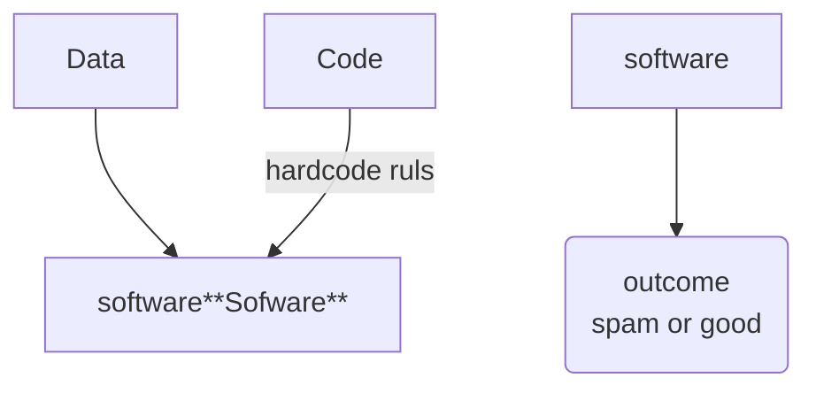
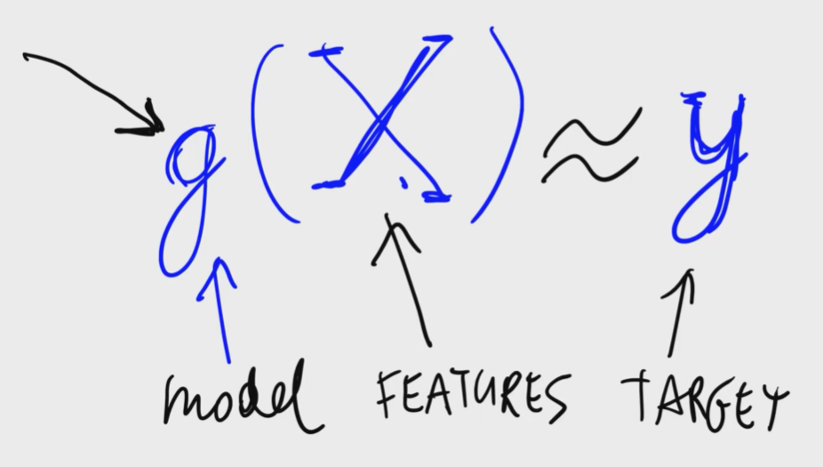
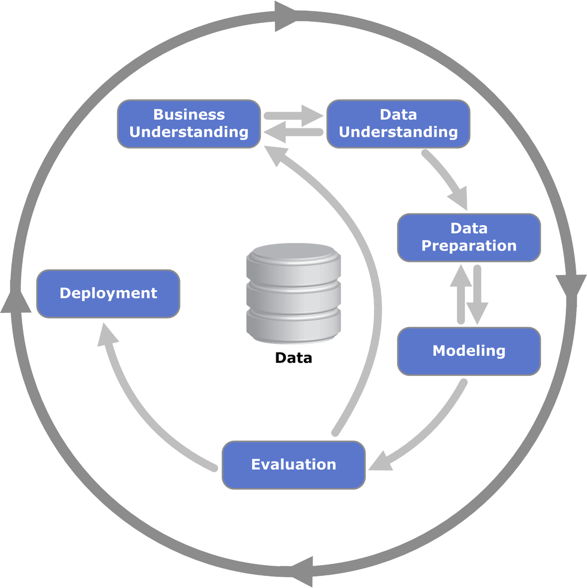
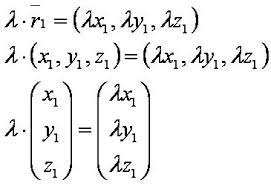
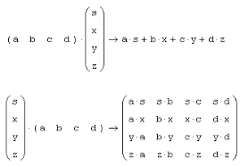
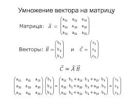
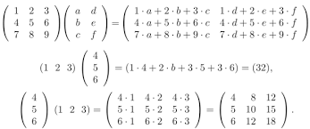
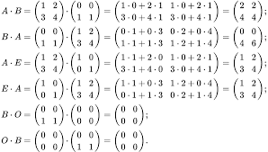
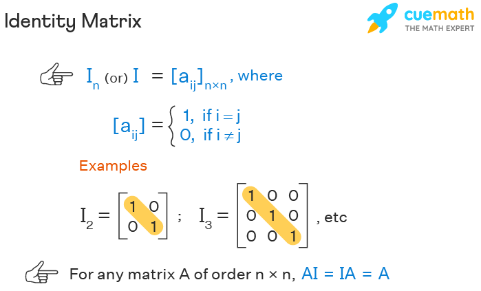

# 🏷Notes Introduction to Machine Learning

## 🏷 1.1 Introduction to Machine Learning

**ML** модели обучаются на 2-х типах данных:

- **features** | фичи - это набор атрибутов, которые наиболее емко характеризуют объект, т.е. являются значимой информацией среди всех имеющихся атрибутов, что бы качественнее определять целевой показатель
- **target** | цель - это целевой показатель, значение, которое предстоит предсказать обученной модели

Далее модель извлекает закономерности из данных и пытается предсказать целевой показатель, которые не учитывались в обучающих данных. Предсказание - это вероятности! Т.о. принятие решение основывается на определении порогового уровня для классификации новых объектов.

Таким образом, ML это процесс по извлечению закономерностей из данных 2-х типов

- features
- target

## 1.2 ML vs Rule-Based Systems

Сравнение машинного обучение с традиционными системами на основе правил (бизнес-правил)

До повсеместного применения ML, большинство информационных системах проектировались на принципе бизнес-правил. В явном виде прописывались условия бизнес-правил (хардкодинг или конфигурации), затем при выполнении кода системы проверяли данные на соответствие правилам после чего система принимала соответствующее проверке решение.
Ярким примером может служить система правил для спам фильтров. На основе анализа, составлялись списки правил по которым спам фильтры принимали решение, относится письмо к спаму или нет. Но спустя время, спамеры совершенствовались в обходе фильтров, спам фильтры пополнялись правилами и в конечном итоге бизнес-правил было уже столько много, что разобраться в логике фильтров и исключений было крайне сложно.



Тогда на помощь пришел ML!
Необходимые шаги для использования ML:

- получить данные
  - это могли быть уже классифицированные сообщения со спамом
  - либо это могли быть сообщения, которые пользователи самостоятельно помечают как `SPAM`
- определить и рассчитать фичи
  - расчет фич может выполняться на бизнес-правилах, которые исполосовывались в традиционной Системе на основе правил, например:
    - длина заголовка > 10? _true/false_
    - длина тела сообщения > 100? _true/false_
    - домен отправителя = "@xxx.com" ? _true/false_
    - и т.д.
- подготовить dataset для обучения на основе предыдущих шагов. Например, на основании рассчитанных фич и пометок от пользователей о принадлежности к спамы мы можем получить следующий набор данных:

|  R1   |  R2   |  R3   |  R4   |  R5   |  ___  | SPAM  |
| :---: | :---: | :---: | :---: | :---: | :---: | :---: |
| true  | false | true  | true  | true  |  ___  | true  |
| false | false | true  | false | true  |  ___  | false |
| false | false | false | false | true  |  ___  | false |
| false | true  | true  | false | true  |  ___  | true  |
| true  | false | false | true  | true  |  ___  | true  |
| true  | false | true  | true  | true  |  ___  | false |

где, `R1..R5` - **features**, `SPAM` - **target** признак спама от пользователей

- обучить на основе подготовленного набора данных модель, используя различные математические алгоритмы
- использовать обученную модель для классификации новых сообщений и принятии решения

|  R1   |  R2   |  R3   |  R4   |  R5   |  ___  | Prediction | Decision |
| :---: | :---: | :---: | :---: | :---: | :---: | :--------: | :------: |
| true  | false | true  | true  | true  |  ___  |    0.87    |   SPAM   |
| false | false | true  | false | true  |  ___  |    0.56    |   GOOD   |
| false | false | false | false | true  |  ___  |    0.73    |   GOOD   |
| false | true  | true  | false | true  |  ___  |    0.96    |   SPAM   |
| true  | false | false | true  | true  |  ___  |    0.34    |   GOOD   |
| true  | false | true  | true  | true  |  ___  |    0.85    |   SPAM   |

для принятия решения принят порог точности предсказания `>= 0.85`

```mermaid
flowchart
 train_data**Data** --features--> ml**ML**
 outcome**outcome \n spam or good** --target--> ml**ML**
 ml --train--> model
 new_data**Data** --> model
 model --predict--> predict**Prediction \n probabilities**
 predict --decision >= 0.85 --> decision**Outcome\n spam or good**
```

## 1.3 Supervised Machine Learning

Контролируемое машинное обучение или обучение с учителем

При контролируемом обучении у нас есть набор объектов и соответствующее каждому объекту целевой показатель target, или как еще называют метка / label. Суть обучения, это нахождение закономерностей в наборе данных, максимально приближенных к значениям меток.

Цель машинного обучения найти математическую функцию, которая бы принимала на вход набор данных из фич, а на выходе получала максимально приближенный результат с нашими целевыми показателями, метками



$\text{g}(\mathcal{X}) \thickapprox \mathcal{y}$
где,

- **g** - модель, математическая или статическая функция
- **X** - 2-х мерный массив с фичами, где строками являются записи объекта, а столбцы фичи
- **y** - одномерный массив, вектор, размерностью равному кол-ву строк в **X** массиве

Машинное обучение решает несколько типов задач/проблем:

- **Регрессия** - результатом функции является измеримое значение. Например стоимость объекта
- **Классификация** - результатом функции будет некая категория. Может разделяться на
  - **multiclass** - классификация изображения: машина, человек, кошка, собака и т.д.;
  - **binary** - спам или не спам;
- **Рекомендация** - результатом будет скоринг определенных объектов с присвоение каждому объекту ранга привлекательности или интереса определенного пользователя, схожего по поведению с группой других пользователей. Далее отбираются ТОП-Х объектов для пользователя. Например товар в онлайн магазине, поиск в поисковых системах, где в том числе могут учитываться предпочтение пользователя на основе предыдущих поисковых запросов.

## 1.4 CRISP-DM MLProcess

**CRISP-DM|CRISP-DM** - Cross-Industry Standard Process for Data Mining, методология для организации процесса ML проектов



### Business Understanding

Перед началом применения ML, первым делом необходимо **понять решаемую проблему**, какие бизнес задачи необходимо решить, какой результат получить на выходе, каким образом получить этот результат.

**Вопросы, которые могут задаваться на данном этапе:**

- Нам на самом деле необходим ML для решения проблемы?
- Правильным ли будет решение, применить ML инструменты для решения конкретной проблемы?

В завершении фазы должны быть **определены цели**, так и **описаны метрики для измерения** достижимости поставленных **целей.** Последняя часть важна для определения успешности проекта, и на сколько близко были достигнуты цели.

### Data Understanding

На данном этапе предстоит проанализировать какие данные необходимы для решения проблемы, какие данные имеются в наличии, а так же каких данных не хватает. Для ML данные имеют первостепенное значение - если  данные отсутствуют , или данные не качественные, тогда успешность построение модели под серьезным вопросом.

**Вопросы которые могут возникать на данном этапе**

- у нас есть необходимые данные для дальнейшего анализа?
- где мы можем получить не достающие данные? Может быть купить или начинать сбор данных
- на сколько качественные данные мы собираем?
- можно ли доверять имеющимся данным? Возможно в наборе ложные данные, на которых мы собираемся обучать модели - в таком случае результат предсказаний будет соответствующим.
- правильно ли мы отслеживаем данные для анализа?
- достаточно ли полученных данных для анализа или необходимо продолжить сбор данных? Если набор данных будет небольшим, то точность предсказания будет низкой по причине отсутствия достаточных знаний.
- Необходимы ли нам дополнительные данные?

Так же в процессе анализа может появиться понимание, что с текущими целями и метриками по измерению ее достижения не возможно идти на следующий этап, и тогда нужно вернуться на предыдущий шаг и уточнить либо цели, либо скорректировать метрики.

### Data Preparation

Трансформация данных таким образом, что бы полученные данные были пригодны для обучения моделей ML алгоритмам.  Так же под этим этапом часто понимают извлечение и расчет дополнительных фич

В общем виде, на данном этапе выполняются следующие шаги

- Очистка данных
- Построение последовательных цепочек обработки данных (build the pipelines)
- Конвертирование гетерогенных источников данных в табличный вид
- Объединение различных источников в единый набор данных (dataset)

### Modeling

Обучение модели на подготовленных ранее данных. Машинное обучение по настоящему случается именно в этом этапе.

В рамках выполнения данного этапа, выполняются следующие шаги:

- выполняется обучение моделей используя различные ML-алгоритмы, различные параметры обучения
- выбирается наиболее успешная модель

Какие алгоритмы могут быть использованы (перечислены только наиболее часто используемые):

- ****Логистическая регрессия****  (_**Logistic Regression**_)
- ****Дерево решений**** (_**Decision Tree**_)
- ****Нейронные сети**** (_**Neural Network**_)
- и многие другие.

В ходе обучения может появиться необходимость вернуться на предыдущий шаг, когда появляется понимание в необходимости рассчитать дополнительные фичи либо скорректировать набор данных (убрать не корректные / ложные данные).  После этого повторяется шаги с поиском наиболее оптимального алгоритма для предсказания - и так может происходить не ограниченное кол-во раз.

### Evaluation

На данном этапе происходит оценка, измерение того как модель решает поставленную задачу и на сколько близко она приблизилась к поставленным метрикам.

Вопросы которые могут возникнуть на данном этапе:

- На сколько обученная модель хороша?
- Мы достигли поставленной цели / решили поставленную задачу?
- Наши метрики улучшились / на сколько улучшились?

Модель оценивается на тестовых данных, либо тестируется на определенной выборке реальных данных.

Если по истечению нескольких итераций с улучшением данных и подбора различных ML алгоритмов мы не получаем удобоваримого результата (пришли к выводу, что цели не достижимы), то возможно это момент для того что бы вернуться на этап понимания бизнес проблемы для корректировки бизнес целей и метрик. В противном случае мы переходим к этапу внедрения обученной модель.

### Deployment

Чаще всего внедрение происходит поэтапным. Для начала модель тестируют в онлайн на небольшой выборке от реальных данных (например 5%), далее происходит оценка полученных результатов. Если результат удовлетворительный, то возможно увеличение доли реальных данных которые передаются на обработку в модель, либо полномасштабное развертывание на все реальные данные.
Параллельно с развертыванием модели на всех пользователей настраивают системы мониторинга, для отслеживания метрик качества работы модели. Это необходимо для того, что если метрики качества снизятся необходимо адаптировать алгоритмы модели под изменения, которые нужно понять - а это значит повторение всего цикла CRISP-DM. Так же возврат на первый этап может быть связан с необходимостью улучшить показатели качества работы модели либо оптимизировать время выполнения модели для работы над большим объемом данных.
В отличии от этапа моделирования, где фокус внимания заострен на компетенциях в области ML - данные этап фокусируются на дисциплинах в области инженерии - процессы должны быть хорошо поддерживаемыми и устойчивыми к сбоям.

## 1.5 Model Selection Process

Детальнее рассмотрим этап Modeling в CRISP-DM процессе.

Выбор ML алгоритма для модели?

- Logistic regression
- Decision tree
- Neural network
- или что-то еще

С предыдущего этапа процесса CRISP-DM - `Data Preparation` у нас должен быть получен набор данных для обучения. Разделим этот dataset на части которые пойдут для обучения / `train` и для проверки / `validation`. Допустим, соотношение этих частей будут 8 к 2 или 80% на 20 %, соответственно. На данном шаге мы не знаем какой ML алгоритм будет предпочтительным для решения нашей задачи, поэтому мы обучаем модели под каждый алгоритм на данных для обучения. После каждого  этапа обучения, мы проверяем модель на данных для проверки.  Рассмотрим пример ниже, обученной на одном из ML алгоритме.

| Вероятность модели | Решение >= 85%-Spam | Проверочные данные | Совпадение |
| :----------------: | :-----------------: | :----------------: | :--------: |
|        0.67        |          0          |         1          |     0      |
|        0.13        |          0          |         0          |     1      |
|        0.89        |          1          |         1          |     1      |
|        0.56        |          0          |         0          |     1      |
|        0.93        |          1          |         1          |     1      |
|        0.79        |          0          |         1          |     0      |

В данном примере, из 6 случаев совпадение с проверочными данными только у 4 случаев, точность составила 4/6 = **0.67%**

Далее таким же образом проверить результаты по остальным моделям. В результате должна получиться примерно следующая таблица.

| метод               | точность | the best |
| ------------------- | -------- | -------- |
| Logistic regression | 0.67     | 0        |
| Decision tree       | 0.56     | 0        |
| Random forest       | 0.76     | 0        |
| Neural network      | 0.80     | 1        |

Таким образом мы приходим к выводу, что NN наилучшим образом справляется с решением нашей задачи.

_Но что если нам просто повезло с набором проверочных данных и полученный высокий результат просто случайность?_

Для большей уверенности, предлагается исходный набор данных делить на 3 части:

1. часть для **обучения** ~60%
2. часть для **валидации** ~20%
3. часть для **тестирования** ~20%

Последнюю 3-ю часть (для тестирования) не используют для сравнения различных моделей - ее оставляют для тестирования модели, которая показала наилучший показатель точности (в примере выше это NN). После того как будет определена наилучшая модель - через нее снова прогоняют тестовый набор данных для того, что бы убедиться, что полученная точность такая-же, или очень близка с точностью, которая была получена на данных для валидации. Если аккуратности сопоставимы (например 0.80 ≈ 0.79) - то можно сделать выводы, что случайности в результатах работы модели нет.

## 🔗1.8 Linear Algebra Refresher

### Vector Operations

#### Vector-number multiplication



#### Vector-Matrix multiplication

 

### Matrix operations

#### Matrix-Matrix Multiplications (dot)





### Identity matrix | Единичная матрица

Единичная матрица (Identity matrix) — квадратная матрица, элементы главной диагонали которой равны единице поля, а остальные равны нулю.



##### 🌐 Other Links

- [Introduction to Machine Learning](https://github.com/alexeygrigorev/mlbookcamp-code/blob/master/course-zoomcamp/01-intro)
-
