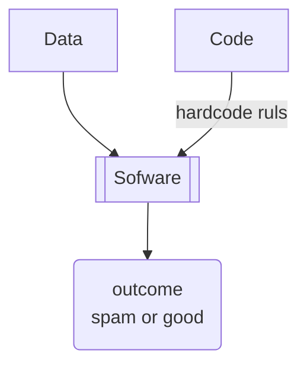
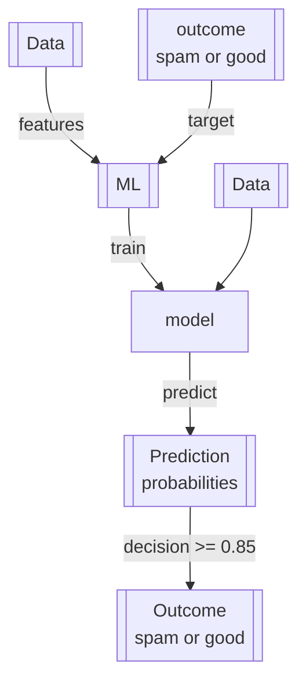

# 🏷Notes Introduction to Machine Learning

## 🏷 1.1 Introduction to Machine Learning

[[ML]] модели обучаются на 2-х типах данных:

- [[features]] | фичи - это набор атрибутов, которые наиболее емко характеризуют объект, т.е. являются значимой информацией среди всех имеющихся атрибутов, что бы качественнее определять целевой показатель
- [[target]] | цель - это целевой показатель, значение, которое предстоит предсказать обученной модели

Далее модель извлекает закономерности из данных и пытается предсказать целевой показатель, которые не учитывались в обучающих данных. Предсказание - это вероятности! Т.о. принятие решение основывается на определении порогового уровня для классификации новых объектов.

Таким образом, ML это процесс по извлечению закономерностей из данных 2-х типов

- features
- target

## 1.2 ML vs Rule-Based Systems

Сравнение машинного обучение с традиционными системами на основе правил (бизнес-правил)

До повсеместного применения ML, большинство информационных системах проектировались на принципе бизнес-правил. В явном виде прописывались условия бизнес-правил (хардкод или конфигурации), затем при выполнении кода системы проверяли данные на соответствие правилам после чего система принимала соответствующее проверке решение.
Ярким примером может служить система правил для спам фильтров. На основе анализа, составлялись списки правил по которым спам фильтры принимали решение, относится письмо к спаму или нет. Но спустя время, спамеры совершенствовались в обходе фильтров, спам фильтры пополнялись правилами и в конечном итоге бизнес-правил было уже столько много, что разобраться в логике фильтров и исключений было крайне сложно.

Тогда на помощь пришел ML!
Необходимые шаги для использования ML:

- получить данные
  - это могли быть уже классифицированные сообщения со спамом
  - либо это могли быть сообщения, которые пользователи самостоятельно помечают как `SPAM`
- определить и рассчитать фичи
  - расчет фич может выполняться на бизнес-правилах, которые исполосовывались в традиционной Системе на основе правил, например:
    - длина заголовка > 10? _true/false_
    - длина тела сообщения > 100? _true/false_
    - домен отправителя = "@xxx.com" ? _true/false_
    - и т.д.
- подготовить датасет для обучения на основе предыдущих шагов. Например, на основании рассчитанных фич и пометок от пользователей о принадлежности к спамы мы можем получить следующий набор данных:

|  R1   |  R2   |  R3   |  R4   |  R5   |  ___  | SPAM  |
| :---: | :---: | :---: | :---: | :---: | :---: | :---: |
| true  | false | true  | true  | true  |  ___  | true  |
| false | false | true  | false | true  |  ___  | false |
| false | false | false | false | true  |  ___  | false |
| false | true  | true  | false | true  |  ___  | true  |
| true  | false | false | true  | true  |  ___  | true  |
| true  | false | true  | true  | true  |  ___  | false |

где, `R1..R5` - **features**, `SPAM` - **target** признак спама от пользователей

- обучить на основе подготовленного набора данных модель, используя различные математические алгоритмы
- использовать обученную модель для классификации новых сообщений и принятии решения

|  R1   |  R2   |  R3   |  R4   |  R5   |  ___  | Prediction | Decision |
| :---: | :---: | :---: | :---: | :---: | :---: | :--------: | :------: |
| true  | false | true  | true  | true  |  ___  |    0.87    |   SPAM   |
| false | false | true  | false | true  |  ___  |    0.56    |   GOOD   |
| false | false | false | false | true  |  ___  |    0.73    |   GOOD   |
| false | true  | true  | false | true  |  ___  |    0.96    |   SPAM   |
| true  | false | false | true  | true  |  ___  |    0.34    |   GOOD   |
| true  | false | true  | true  | true  |  ___  |    0.85    |   SPAM   |

для принятия решения принят порог точности предсказания `>= 0.85`

## 1.3 Supervised Machine Learning

Контролируемое машинное обучение или обучение с учителем

При контролируемом обучении у нас есть набор объектов и соответствующее каждому объекту целевой показатель target, или как еще называют метка / label. Суть обучения, это нахождение закономерностей в наборе данных, максимально приближенных к значениям меток.

Цель машинного обучения найти математическую функцию, которая бы принимала на вход набор данных из фич, а на выходе получала максимально приближенный результат с нашими целевыми показателями, метками

$$ \text{g}(\mathcal{X}) \thickapprox \mathcal{y} $$
где,
- **g** - модель, математическая или статическая функция
- **X** - 2-х мерный массив с фичами, где строками являются записи объекта, а столбцы фичи
- **y** - одномерный массив, вектор, размерностью равному кол-ву строк в **X** массиве

Машинное обучение решает несколько типов задач/проблем:
- **Регрессия** - результатом функции является измеримое значение. Например стоимость объекта
- **Классификация** - результатом функции будет некая категория. Может разделяться на
	- **multiclass** - классификация изображения: машина, человек, кошка, собака и т.д.;
	- **binary** - спам или не спам;
- **Рекомендация** - результатом будет скоринг определенных объектов с присвоение каждому объекту ранга привлекательности или интереса определенного пользователя, схожего по поведению с группой других пользователей. Далее отбираются ТОП-Х объектов для пользователя. Например товар в онлайн магазине, поиск в поисковых системах, где в том числе могут учитываться предпочтение пользователя на основе предыдущих поисковых запросов.
